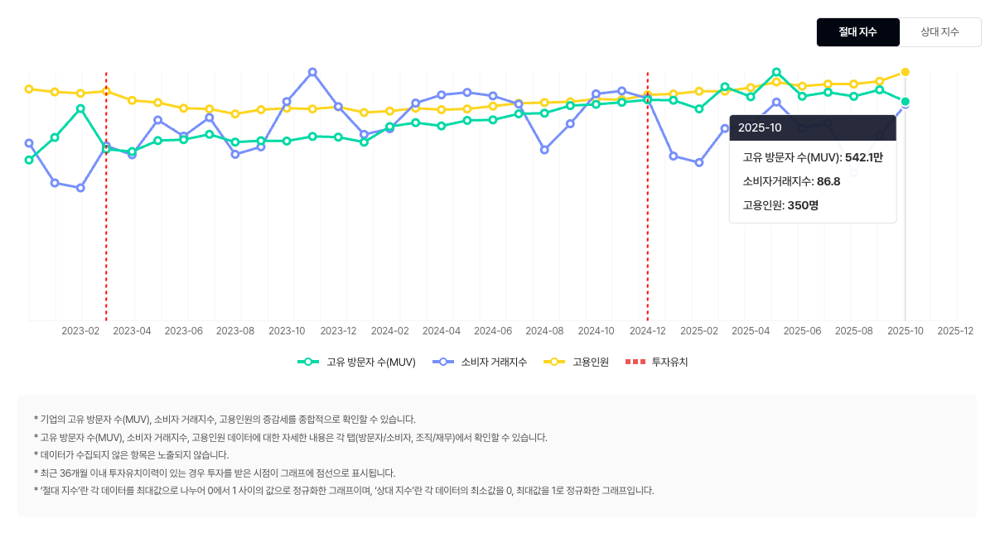

# Ref.

- [에이블리 플레이북 2.0 (25.07 업데이트)](https://docs.google.com/presentation/d/1GGVCoXVmtxwLLB-EEABC71mQgZ4tlMd8KRIshMl4-74/edit?slide=id.g2e23807e0b7_0_81#slide=id.g2e23807e0b7_0_81)
- 에이블리코퍼레이션 홈페이지
  - https://ably.team/
- EO 유튜브 대표 인터뷰
  - https://www.youtube.com/watch?v=ETnROJe4OfA
- 위치 : 신논현역 교보문구 타워
- 비상장 Series D
- 직원수 : 350명 (2025년 10월 기준, 퇴사율 최근 **46.6%) 입/퇴사자 왤캐 많지..;**
- 채용 정보
  - https://recruit.ably.team/job_posting/wy6yCqBK
- 사업보고서
  - https://dart.fss.or.kr/html/search/SearchCompanyIR3_M.html?textCrpNM=%EB%B1%85%ED%81%AC%EC%83%90%EB%9F%AC%EB%93%9C
- 예측 수익 구조
    - 각 서비스별 셀러 수수료 수익
    - AI 서비스 판매 수익
- 에이블리에는 왜 사람이 모일까?
    - 젊은 세대를 저격하여 서비스를 하다보니 비교적 쉽게 노출이되어 인지도가 있어서 그런 것 같다.
    - 그러면서도 공격적으로 규모와 사업을 늘리며 빠르게 달리고 있는 슈퍼카 같은 느낌.
    - 여기에 같이타서 뭐라도하면 좋을 것 같다는 느낌도 들고.

## 나는 왜 에이블리에 가고 싶은가?

### 기술 측면

- 직무 전환
- 대규모 트래픽을 다루어 볼 수 있는 기회
- 해보고 싶은것들을 기획해보고 제안할 수 있는 환경인 것 같다.

### 커리어 측면

- 이커머스 도메인으로 현시대를 살아가고 있는 사람으로써 이 도메인이 오래 지속될 것 같다.
- 이 후 이직할 때 용이할 것 같음.
- 아예 관심없는 도메인도 아니다.
- 일명 네임드 회사라 다음 이직할 때 비교적 유리할 것 같다.