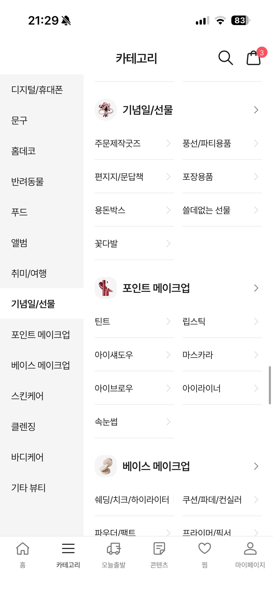
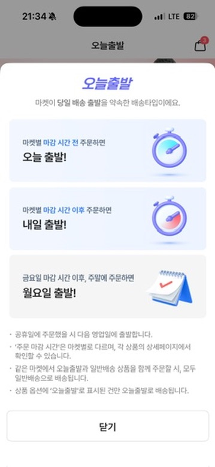
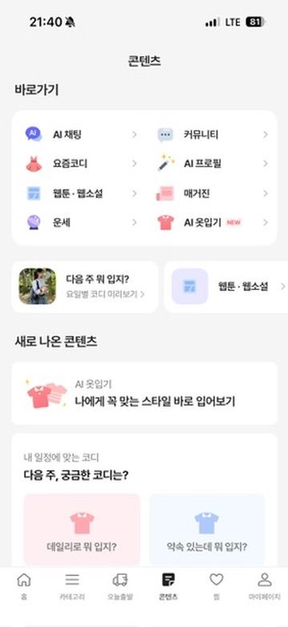
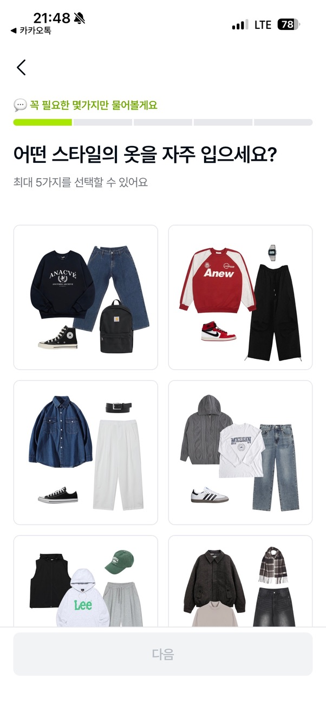
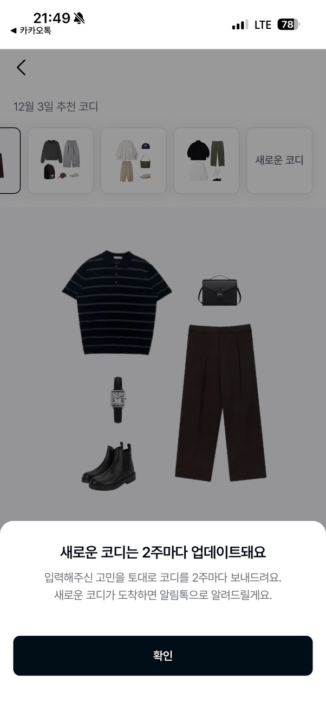
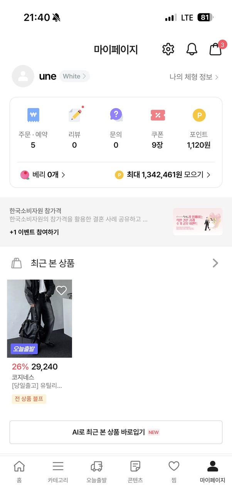
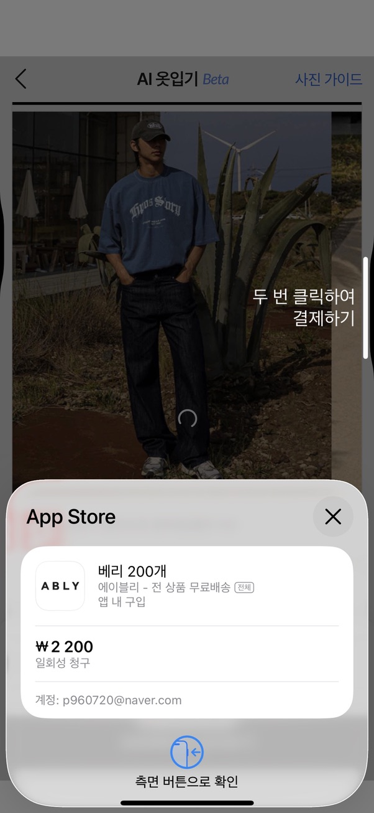
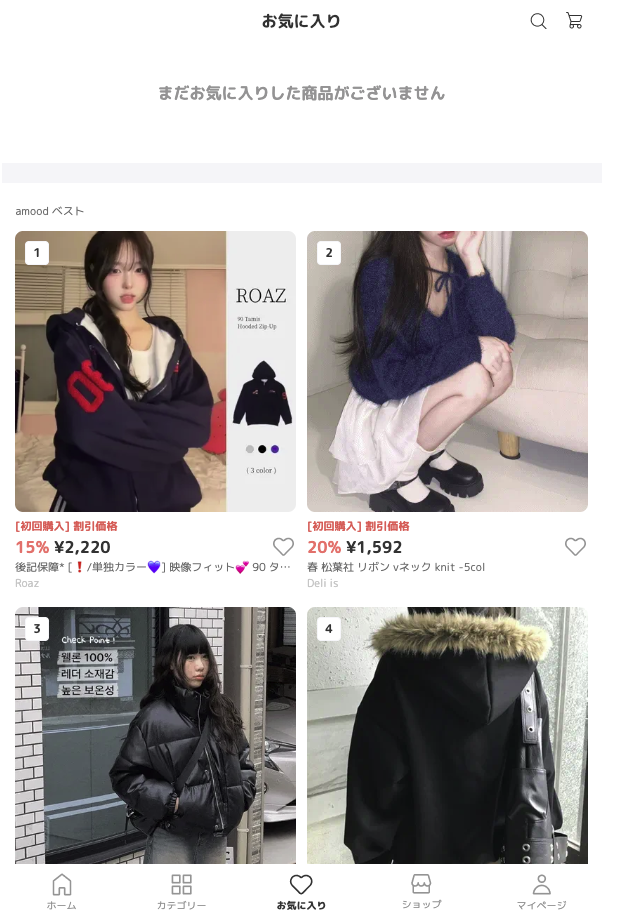
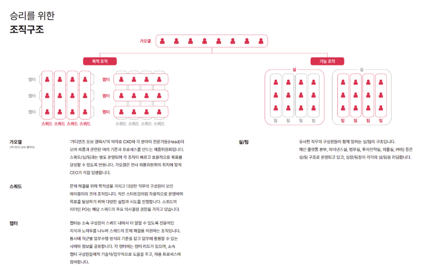

# 목차
- [미션 의도](#미션-의도)
- [뱅크샐러드](#banksalad)
- [에이블리](#ably)
- [개인 생각](#개인-생각)

## 미션 의도

이번 미션은 각 문항을 통해 기업별로 차별화된 특징을 이해하고, 지원하기 전에 내가 해당 기업을 어떻게 바라보고 있는지를 정리해보라는 의도로 다가왔습니다.

이전까지는 보통 서류에 합격하고 테스트를 거쳐 직무 면접을 보기 전에 ‘혁신의 숲’이나 ‘The VC’를 통해 기본적인 정보를 찾아보고, 회사 홈페이지나 블로그가 있다면 가볍게 훑어보는 정도로 끝났습니다. 하지만 이번 미션을 통해 하나의 기업을 분석할 때 단순히 정보를 조사하는 데서 그치는 것이 아니라, 어떤 시각으로 기업을 바라봐야 하는지, 그리고 앞으로 개발자로서 이 기업에 정말 가고 싶은지, 그렇다면 어떤 부분을 보완해야 하는지까지 고민해볼 수 있었습니다.

특히 기업이 어떤 서비스를 운영하고 있고, 특정 기능이 왜 생겨났는지 생각해보는 과정에서 자연스럽게 회사의 비전과 연결되었고, 이에 더 깊이 공감할 수 있었습니다.

각 항목에 대한 답변을 우선 정리한 뒤, 추가적으로 조사한 내용은 참고 자료에 별도로 정리해 두었습니다.

<a id="banksalad"></a>


## 어떤 비전을 가지고 있나요?
뱅크샐러드는 **고객의 가장 큰 이익을 보증하는 혁신으로 위대한 변화를 만든다**는 목표 아래
국내 개인 금융 데이터 표준화 인프라 구축을 선도한 기업이다.

핵심은 **프로덕트 중심** 사고다.
금융 데이터를 통해 고객의 실제 행동·결정을 개선하고, 더 나은 선택을 가능하게 하는 것을 궁극적 가치로 둔다.

## 어떤 방식으로 일을 하나요?

[인재상 및 원칙.md](./resources/뱅크샐러드_인재상_및_원칙.md)  
DE팀 인터뷰 : https://blog.banksalad.com/pnc/team-interview-de

해당 자료 기반으로 정리한 뱅크샐러드의 일하는 방식은 다음과 같다.

**기술 문화**

- Pn 기반 코드리뷰(RCA 룰 기반)
- 페어 프로그래밍
- 건강한 피드백 문화
- 사내 해커톤 등 실험적 시도 장려

**데이터 엔지니어 인재상**

- 능숙한 백엔드 기반 기술
- 대규모 데이터의 안정적 처리 능력
- 데이터를 “제품 관점”에서 바라보는 시각
- AI 시대의 변화에 빠르게 적응
- 전사와 원활한 협업
- 실험·문제 해결 중심의 스타트업 문화 적합성
    

## 어떤 서비스를 운영하고 있나요?

핵심적으로 다음 네 가지 틀로 정리할 수 있다.

**통합 자산 관리 / 개인 금융 데이터 조회**  
- 리포트, 소비 패턴 분석 등

**금융상품 비교·추천**  
- 카드 / 대출 / 보험  
- 중개 수수료 기반 수익 모델  

**헬스케어 / 건강 데이터 서비스**  
- 건강 데이터 분석  
- 유전자 검사, 미생물 검사 등 확장적 기능  

**마이데이터 기반 인프라**  
- 금융기관 연동  
- 개인 금융 데이터 정규화 및 표준화  
- 자동화 기반 서비스 운영  

이 네축을 조합하면 뱅크샐러드가 **금융 + 헬스 기반 개인 라이프 매니저먼트 플랫폼**을 지향하고 있음을 알 수 있다.

[사용자 목적별 이용 서비스.md](./resources/뱅크샐러드_사용자_목적별_서비스.md)

### 서비스 소개서


## 각 서비스의 조직도를 직접 예측해 보세요.

공개된 정보와 채용공고를 기반으로 재구성한 조직 구조는 다음과 같다.

```
대표이사(CEO)
 ├─ CTO
 │    ├─ 백엔드
 │    ├─ 프론트엔드(Web)
 │    ├─ 모바일(iOS/Android)
 │    ├─ DevOps/인프라
 │    └─ 데이터 파운데이션
 │         ├─ 데이터 엔지니어링
 │         ├─ 데이터 분석(Analytics)
 │         ├─ 머신러닝/AI
 │         └─ 데이터 플랫폼 운영
 │
 ├─ 프로덕트 조직
 │    ├─ 금융
 │    ├─ 보험
 │    ├─ 헬스
 │    └─ Growth/마케팅
 │
 ├─ 사업 본부
 │    ├─ 금융/보험 제휴
 │    ├─ 신사업/전략기획
 │    └─ 파트너십/운영
 │
 └─ People & Culture
```

[데이터 엔지니어 채용 공고](https://www.notion.so/2bd7443f2ea08038bc07e0528812a16c?pvs=21)
Todo. 채용공고 상세분석 추가
 
## 참고 자료 및 인사이트 정리

뱅크샐러드가 기술적으로 조명받는 이유는
- 빅테크 출신 엔지니어 구성
- 금융 데이터 표준을 선도한 기술력
- 성장성 높은 도메인
- 재직자·시장의 긍정적 평가
등이 있다.

재무 데이터 기준 매출 성장 곡선이 우상향이며,
특히 데이터 중심 서비스 기반 기업으로 장기 성장성이 높다고 평가된다.

- **홈페이지** : https://www.banksalad.com
- **개발블로그** : https://blog.banksalad.com
- **위치** : 서울특별시 마포구 마포대로 45, 일진빌딩 10층
- **업력** : 13.4년
- **상장 여부** / 투자 라운드 : 비상장 / Series D
- **직원수** : 147명 (2025년 10월 기준, 퇴사율 최근 6개월 22.1%)
- **채용 정보** : [대규모 채용 ~12.31](https://corp.banksalad.com)
- **사업 보고서** : https://dart.fss.or.kr/html/search/SearchCompanyIR3_M.html?textCrpNM=%EB%B1%85%ED%81%AC%EC%83%90%EB%9F%AC%EB%93%9C


## 나는 왜 뱅크 샐러드에 가고 싶을가?

기업 분석을 하다보니, 매력적으로 느껴져 정말 이 회사를 가게 된다면 무엇을 얻을 수 있을지를 두가지 측면으로 작성해보았습니다.

**기술 측면**
- 금융 도메인의 복잡도가 높아 데이터 모델링 난이도가 크며, 이를 해결하는 경험을 해보고 싶다.
- 스트리밍 + 배치 혼합 데이터 파이프라인 등 다양한 구조 경험 가능.
- 개인정보/보안 등 고난도 요구사항을 다룰 수 있는 기술 환경.
- 기술적 난이도가 높은 문제를 해결하며 성장할 수 있는 조직.

**커리어 측면**
- 금융 데이터는 산업 전반에 걸쳐 높은 프리미엄을 가진다.
- 뱅크샐러드 경험 → 토스, 네이버 파이낸스, 카카오페이 등 다양한 커리어 확장 경로 존재.
- 장기적으로 금융 데이터 기반의 기술 전문가로 성장 가능.

이렇게 작성하고보니, 그동안의 저의 경험과 뱅크샐러드에서 원하는 인재상, JD 기반의 요구 역량들을 봤을 때 현재 '저'의 상태를 되돌아볼 필요가 있다는 생각이 들었습니다.
어떤 방법이 있을까 생각해보다가 AI를 활용하여 적합도 분석을 해보자라는 생각이 들어 한번 해보았습니다.
최종 적합도 평가: 82% 결과과 도출되었고, 핵심 서비스에 대한 관심도가 낮다는 점이였습니다. 
[적합도 판단(w/ AI).md](./resources/뱅크샐러드_적합도_분석.md)

추후 진행하면 좋을 프로젝트도 추천해줘서 금융 데이터 모델링을 연습할 수 있는 방향으로 학습하고자 합니다.

---

<a id="ably"></a>


## 어떤 비전을 가지고 있나요?

에이블리는 아래 두 가지를 핵심 비전으로 제시한다.
- “누구나 창업·판매자가 될 수 있는 환경 구축”
- 개인화된 스타일 탐색 경험을 기반으로 셀러와 유저가 상생하는 생태계를 글로벌로 확장

즉, 에이블리는 Creator Economy + Commerce + Personalization의 결합에 가까운 비전을 지닌다.

---

## 어떤 방식으로 일을 하나요?

에이블리의 일하는 방식은 대표적으로 세 가지 키워드로 요약된다.

**원팀 : 문제 중심 스쿼드**
- 직무가 아닌 “해결해야 할 문제” 중심으로 팀이 구성된다.
- UX, 백엔드, 데이터 등 다양한 직군이 하나의 목표를 향해 움직인다.

**임팩트 : 지표 중심 실행**
- “무엇을 만들었는가?”보다
- “고객이 얼마나 개선되었는가?”,
- “성장이 일어났는가?”를 우선순위로 본다.

**그릿 : 장기 목표를 집요하게 달성**
- 거대한 목표를 제시하지만, 이를 시스템적으로 달성하기 위한 구조적 실행력을 중요하게 본다.

에이블리는 “스타트업 + J커브 성장 + 강한 실행력”의 문화적 문법을 가지고 있다.

### 인재상 (EO 인터뷰 내용)
Final 면접에 CEO님이 꼭 참석하셔서 물어보는 질문이라고 합니다.

5000조 기업 가치를 달성하기 위해서 열정을 가지고 기여하겠다.  
유튜브와 앱스토어를 잇는 넥스트 커머스 생태계를 만들겠다.  
우주에 흔적을 남기겠다. 그걸 통해 나는 이 세상에서 큰 성취를 이루겠다.
이 의견에 동의 할 수 있겠습니까?

---

## 어떤 서비스를 운영하고 있나요?

### 요약

세 서비스 모두 개인화 추천 + 콘텐츠 + 커머스 구조를 공유하며,
“슈퍼앱화”되고 있다는 공통적인 방향성을 가진다.

**ABLY (여성 중심 라이프스타일 커머스)**

- 의류뿐 아니라, 리빙/취미/콘텐츠 등 카테고리 확장
- 풀필먼트 센터 기반의 ‘오늘 출발’ 물류 기능
- AI 기반 콘텐츠·모델 활동·크리에이터 생태계 구축

**4910 (남성 의류)**

- 개인화 추천·체형 기반 코디 추천(Beta)
- 모델 활동 기능
- 코디 세트가 아닌 “개별 구매 가능 구조”로 구매 리스크 감소
- 매주 혹은 격주 업데이트되는 개인화 상품 추천

**Amood (일본 K-패션 커머스)**

- 일본 내 K-패션 수요를 타깃
- 모바일 웹 중심의 가벼운 UX
- 글로벌 확장 초기 단계로 보임

### 상세
#### 에이블리

10-30대 단순 여성 의류 쇼핑몰로만 알고 있었는데, 앱에 접속해보니 카테고리가 엄청 많았다. 특이하게도 오늘의 집, 아이디어스 서비스의 모습이 많이 보임.

<div>
    
    
</div>

단순 에이블리가 중개만 해주고 각 판매자들이 주문이 접수되면 개별 발송하는 건줄 알았는데 **“오늘 출발”**메뉴가 유독 눈에 띄어 찾아버게되었습니다. 이 물류 파이프라인을 구축하기 위해서는 쿠팡 처럼 대형 물류 센터가 있어야 가능한거 아닌가? 싶은 생각에 찾아보니 원래도 있었고 22년도에 3000평 규모의 풀필먼트 센터를 가지고 있다는 사실을 알았다.

[에이블리 풀필먼트 센터](https://ably.team/news/Y1YkwRAAAJY1lTBY)

이외에도 모델 활동을 해서 월 30만원 수준의 부업을 할 수 있는 서비스도 있었고,

AI를 활용한 콘텐츠, 웹소설, 커뮤니티 등등.. 여러 기능을 가지는 슈퍼앱이 되어가는 느낌을 받았다.



#### 4910

10대 ~ 30대 남성 의류 쇼핑몰 서비스

전반적으로 에이블리의 앱을 베이스로 남성 전용으로 서비스하는 걸로 보이고 차별화된 특징은 추천 서비스가 잘 되어 있다는 느낌을 받았고 체형별 코디 추천을 Beta 버전으로 운영하는 점이 눈에 띄었다.

에이블리의 모델 활동처럼 4910에서도 남성 모델 활동을 할 수 있다.

그리고 기능을 탐색해보던 중에 맘에 들었던 기능도 있었는데 평소 입는 스타일을 선택해두면, 2주마다 추천 코디를 업데이트 해준다는 점이다. (전에 어떤 앱이였는지 정확하게 기억은 안나지만) 한벌 코디 세트로 판매하는 서비스가 있었는데 서비스를 이용하지 않았다.

왜냐하면 코디 세트에서 원하지 않는게 하나라도 있으면 ‘괜히 샀다가 돈 버리는거 아닌가?’ 라는 생각이 컸기 떄문이였다. 근데 에이블리 앱에서는 개별 상품으로 판매해서 원하지 않는다면 안사면 그만이기 때문에 긍적적인 평가를 해본다.

<div>
    
    
</div>

AI로 최근 본 상품을 내 사진과 함께 합성 해주는 기능이 있었는데 아무 모델 사진을 가져와 테스트해보고 싶었으나
물론 예시 이미지는 제공되지만 어떤 결과물이 나올지도 모른채 결제를 해야한다는 부담감이 있었다.

<div>
    
    
</div>

#### Amood

서비스 페이지 : https://www.amood.jp/favorite

10대 ~ 30대 **일본** 여성 의류 쇼핑몰 서비스

일본인들이 K패션을 좋아하는 것을 타게팅 한 것 같고, 에이블리와 동일한 방향성으로 가고자 하는 것 같다. 일본에서는 K패션을 좋아하는 사람들에게는 차별화된 서비스로 보인다.

아직 앱은 없는 것 같고, 웹에서 모바일 뷰로 제공함. (디바이스가 변경되어도 디자인은 늘 동일해서 좋을 듯.)



https://www.nbnews.kr/news/articleView.html?idxno=106766

## 각 서비스의 조직도를 직접 예측해 보세요.



에이블리는 목적 조직(Squad) + 기능 조직(Chapter)을 결합한 구조로 상황에 따라 유연하다.
- 스쿼드 : 목적성 조직, PO가 주요 의사 결정
- 챕터 : 같은 직무인 분들, 챕터 헤더가 있고 챕터는 서로 상호보완함.

즉, Spotify Model류의 하이브리드 조직 구조로 보인다.

## 참고 자료

[Ref.](resources/에이블리_참고자료.md)  
[에이블리_적합도_분석](resources/에이블리_적합도_분석.md)

## 느낀 점

에이블리는 전반적으로 매우 독특한 조직 문화와 강한 철학을 가진 기업이라는 느낌을 받았다.


플레이북에서 거대한 서사(달나라 비유 등)를 전면에 내세우며 큰 목표를 추구하는 문화를 강조한다.  
과거 빠른 성장 경험이 있다 보니, 이를 기반으로 한 자신감과 실행 철학이 강하게 드러난다.  
이 때문에 긍정적으로 보면 “혁신적이고 몰입도 높은 조직”, 반대로 보면 “다소 종교적·강한 신념 집단 같은 분위기”도 존재하는 것 같다.

---

## 개인 생각 

기업 분석을 하면서 가장 도움이 된 부분은 단순히 정보를 수집하는 것이 아니라, 비전·일하는 방식·서비스 구조를 각각 다른 관점에서 읽어내는 훈련이었다.

특히 비전 분석을 통해 해당 기업의 가치관이 나와 맞는지, 그리고 지원 동기에서 어떤 관점을 강조해야 하는지를 명확하게 판단할 수 있었다. 덕분에 단순한 관심이 아니라 “이 기업이 왜 존재하고, 무엇을 바꾸려고 하는가”라는 더 깊은 질문을 스스로 던질 수 있었다. 이러한 관점은 장기적으로 회사가 어떤 기술적·제품적 방향을 추구할지 이해하는 데도 큰 도움이 되었다.

또한 일하는 방식에 대한 조사는 “이 조직이 원하는 인재상은 무엇인가?”를 구체적으로 판단하게 해주었다. 예를 들어 뱅크샐러드는 단순히 데이터를 처리하는 ETL 엔지니어가 아닌, 백엔드·플랫폼·운영·AI Enablement를 모두 아우르는 풀스택 데이터 엔지니어를 기대한다는 점을 파악할 수 있었다. 이를 기준으로 나의 현재 역량과 앞으로 보완해야 할 부분도 자연스럽게 정리되었다.

서비스 운영 방식 분석 역시 중요한 인사이트를 준다. 서비스를 어떻게 구성하고, 어떤 수익 구조를 가지고 있으며, 어떤 연령대를 타깃으로 하고 있는지를 파악하면 해당 기업의 핵심 가치와 시장 포지셔닝이 더 명확하게 보인다. 이는 곧 “내가 이 기업에서 어떤 문제를 해결할 수 있을까?”라는 질문과 직접 연결된다.

결국 이러한 세 가지 관점을 종합해보면, 기업 분석은 단순한 정보 정리가 아니라 나의 커리어 방향과 기업의 방향성이 얼마나 맞닿아 있는지를 확인하는 과정이었다. 이번 미션을 통해 기업을 훨씬 더 입체적으로 바라보는 시각을 얻을 수 있었다고 느낀다.
